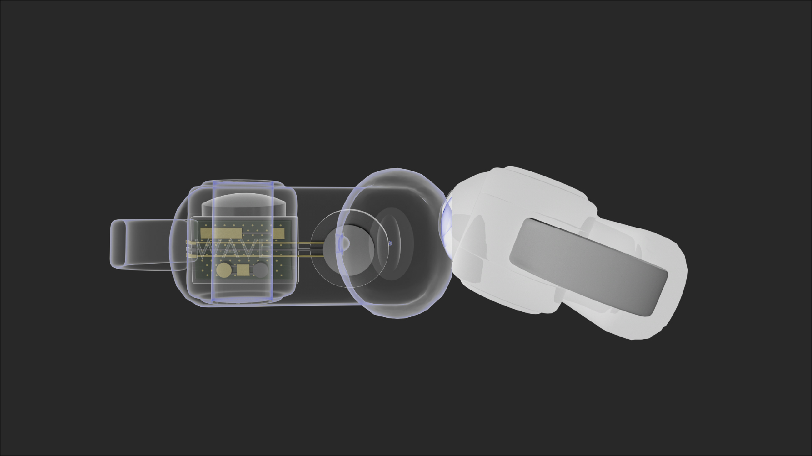

# Earbuds Promotional Page

Welcome to my Earbuds Promotional Page! This is a promotional webpage created to showcase my 3D earbuds, combining product visualization from Cinema 4D with a modern, responsive web design.

## **Table of Contents**
- [Overview](#overview)
- [Tools Used](#tools)
- [Features](#features)
- [Installation](#installation)

<h2 id="overview">Overview 🔎</h2>
A clean and modern promotional website showcasing 3D earbuds and a charging case, designed and rendered in Cinema 4D, with smooth animations using GSAP.

<h2 id="tools">Tools Used 💡</h2>
Here’s a snapshot of the skills and tools featured across my project:

**Languages 💻**  
HTML5, CSS3, JavaScript

**Frameworks and Libraries 🛠️**  
Sass, Greensock

**Tools 🧰**  
Git, Figma, Adobe Illustrator, Cinema 4D

<h2 id="features">Features 🌟</h2>

📌 Responsive across all devices 

📌 Accessible & User-Friendly 

📌 Smooth animations with GSAP

<h2 id="installation">Installation ⚙️</h2>
To run the project locally:

- Clone this repository
- Navigate into the project directory
- Open the index.html file in your browser, or if using a local server, start the server and navigate to localhost to view.